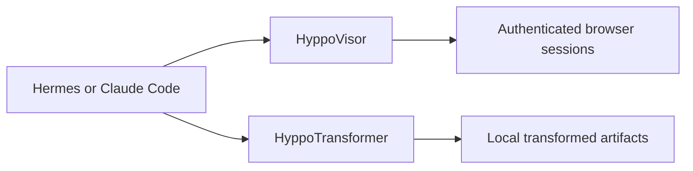

# Design notes

## Why a standalone service

HyppoTransformer performs local artifact transformation, not browser-session
management. A standalone Node service is simpler than an Electron application and
can run on the Mac where Pandoc and the browser renderer are installed.

## Why HyppoTransformer is separate from HyppoVisor

The projects share family principles but own different capabilities:



HyppoVisor provides controlled access to browser sessions. HyppoTransformer
provides controlled transformation of local artifacts. Neither needs to import
the other.

## Why profiles instead of personal logic

A universal transformation service must work for multiple users, repositories,
operating systems, styles, and document types. Workspace roots, executable
locations, stylesheets, page settings, and output naming therefore belong in
trusted configuration and named profiles.

The service should not know whether a document is a CV, report, note, or book.
That meaning belongs to the calling workflow.

## Why the first tool is small

The first public capability is only:

```text
transform_markdown_to_pdf
```

This keeps the security and protocol surface auditable. Generic verification,
preview, extraction, and additional transformations can be added later when
real use cases justify them.

## Rendering boundary

The service runs where the rendering tools are installed. For the current setup,
that means the Mac host, while Hermes may run inside Docker and connect through
HTTP. The repository remains the source of truth for Markdown and related assets;
the renderer is a local execution dependency.
